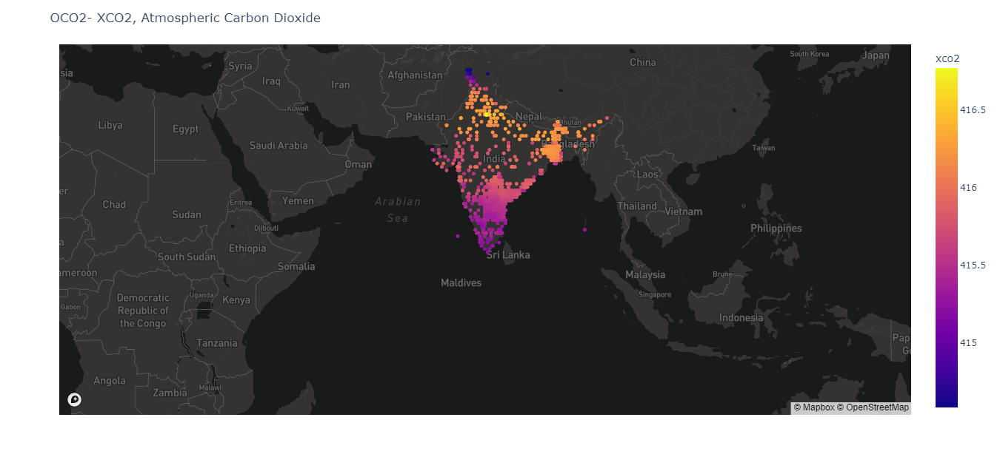

# Measuring-Carbon
Use of Satellite imagery and AI to support decarbonization efforts; offering a path for standardized, affordable and easy to use monitoring, reporting and verification of carbon emissions

This study takes a completely different approach, employing only direct CO2 observations from NASA's OCO2/OCO3 satellites. The dependent variable in our model is the atmospheric CO2 concentration above an
urban area. For climate change analysis, the dominant concentration component is the global cumulative stock of long-duration CO2 molecules that have been emitted by human activity since 
the Industrial Revolution. 

We specify a linear estimation model above India's cities because the atmospheric CO2 load should be additive in CO2 emissions from different sources. Spatially-referenced variables in the model are translated to consistent measures by resampling to centroids for grid cells with a resolution of 10 km. We allow 
for measurement “spillover” as emissions diffuse from source cells to neighboring grid cells. 
